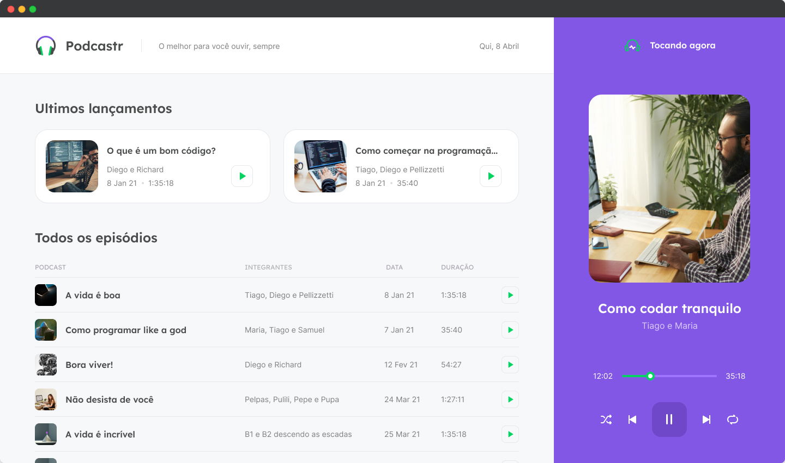

<h1 align="center">
  
</h1>

  

 

 

  

## ✨ Tecnologias

Esse projeto foi desenvolvido com as seguintes tecnologias:

- [Angular](https://angular.dev)
- [NgRx](https://ngrx.io/guide/store)
- [TypeScript](https://www.typescriptlang.org/)

## 💻 Projeto

O podcastr é um app para reprodução de episódios em áudio do seu podcast favorito.

## 🔖 Layout

Você pode visualizar o layout do projeto através [desse link](https://www.figma.com/file/UwFEntsHpHYJlHNQAQr4gA/Podcastr/duplicate). É necessário ter conta no [Figma](http://figma.com/) para acessá-lo.

## 🚀 Como executar

- Clone o repositório
- Instale as dependências com `npm install`
- Inicie o servidor com `ng server`

Agora você pode acessar [`localhost:4200`](http://localhost:4200) do seu navegador.

## 📄 Licença

Esse projeto está sob a licença MIT. Veja o arquivo [LICENSE](LICENSE.md) para mais detalhes.

---

Feito com ♥ by Jefferson Ferreira 👋🏻